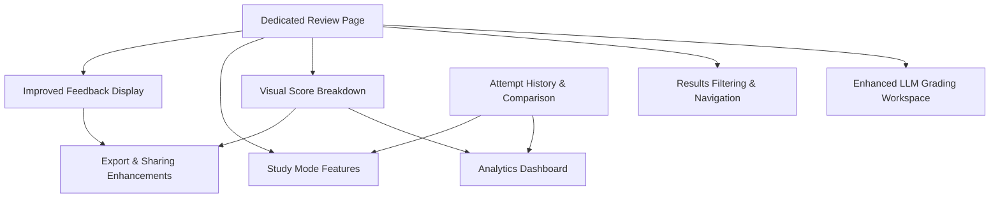

# Post-Submission UX Improvement Plan

This document restructures the nine improvement areas into discrete work items so that they can be scheduled for concurrent or sequential execution.

## Itemized Improvements

1. **Dedicated Review Page**  
   Create `/review/:attemptId` route with full-page layout, question navigator, and summary header. This replaces the cramped modal and becomes the foundation for the rest of the enhancements. *(Fully applicable offline.)*
2. **Enhanced LLM Grading Workspace**  
   Build an inline grading experience (rubric sliders, feedback editor, validation) that still relies on manual paste loops for offline usage. Automated calls remain out-of-scope offline. *(Partially applicable offline.)*
3. **Results Filtering & Navigation**  
   Add filter chips (all/incorrect/pending), sorting, search, and keyboard navigation for traversing questions inside the review page. *(Fully applicable offline.)*
4. **Visual Score Breakdown**  
   Provide charts for deterministic vs. subjective scores and tag/type breakdowns, rendered locally via a bundled chart component. *(Fully applicable offline.)*
5. **Attempt History & Comparison**  
   Persist attempts in IndexedDB/localStorage, list prior attempts, and enable side-by-side comparisons or "retake incorrect" flows. *(Fully applicable offline.)*
6. **Study Mode Features**  
   Allow review without answers, marking questions for later, and storing personal notes/annotations. *(Fully applicable offline.)*
7. **Improved Feedback Display**  
   Expand feedback panes with diff view, highlighting, and expandable explanations to contrast user vs. expected answers. *(Fully applicable offline.)*
8. **Analytics Dashboard**  
   Layer on richer analytics (performance trends, tag insights, heatmaps) beyond the basic visual breakdown. *(Fully applicable offline.)*
9. **Export & Sharing Enhancements**  
   Improve PDF/print exports and structured data downloads; omit URL sharing due to offline constraints. *(Fully applicable offline when limited to local exports.)*

## Dependency DAG (text form)

- **Dedicated Review Page** → Enables **Enhanced LLM Grading**, **Results Filtering & Navigation**, **Visual Score Breakdown**, **Study Mode**, and **Improved Feedback Display**.
- **Visual Score Breakdown** → Provides baseline data for **Analytics Dashboard** and informs **Export Enhancements**.
- **Attempt History** → Supplies longitudinal data for **Analytics Dashboard** and optional context for **Study Mode**.
- **Improved Feedback Display** → Feeds richer content into **Export Enhancements**.
- **Analytics Dashboard** → Depends on both **Visual Score Breakdown** and **Attempt History**.
- **Export Enhancements** → Depend on **Dedicated Review Page**, **Visual Score Breakdown**, and **Improved Feedback Display** for layout/data.

This produces the following DAG layering:

1. Base Layer: Dedicated Review Page, Attempt History, Improved Feedback Display.
2. Middle Layer: LLM Grading Workspace, Results Filtering & Navigation, Visual Score Breakdown, Study Mode.
3. Upper Layer: Analytics Dashboard, Export Enhancements (both require outputs from earlier layers).

## Mermaid DAG

